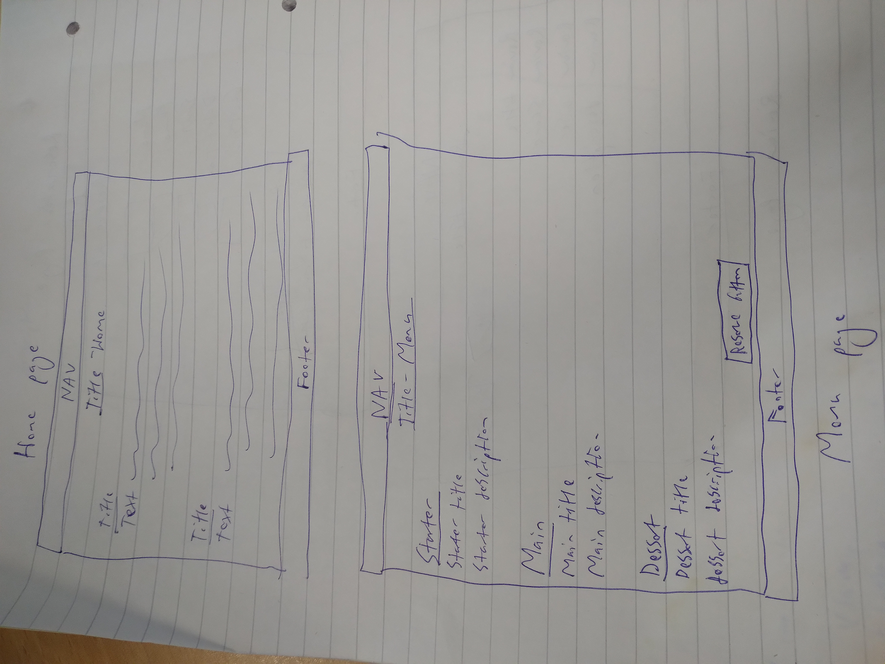
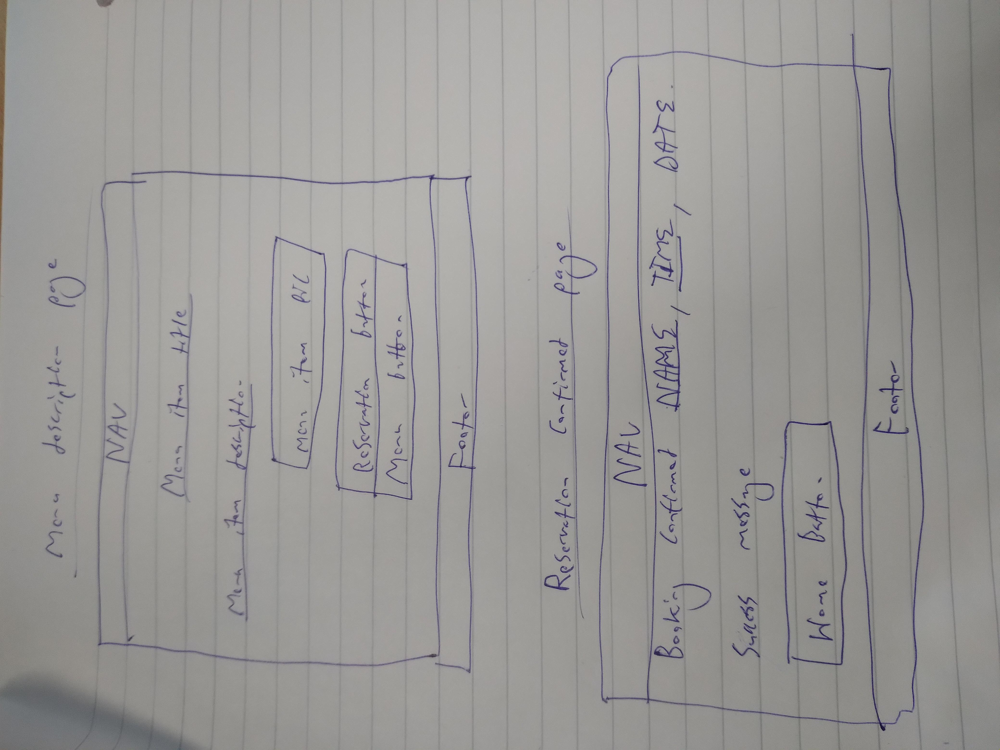

# README.md For Milestone Project 3

The purpose of this project was to create a fictitious restaurant website to demonstrate my proficiency in Python, Django, and other skills that I have developed on my diploma in web development with code institute.

Superuser credentials (case sensitive):

Username = MARKANTONY07

Password = MillieandCharlie04*

## Table of Contents

#### 1. UX

- Project Goals

- Developer and Business Goals

- User Goals

- User Stories

- Wireframes

#### 2. Features

- Existing Features

- Features Left to Implement 

#### 3. Technologies Used

- Github

- Bootstrap 

- Chrome Dev Tools 

-  Python, Django, JavaScript, HTML5, & CSS3

- Visual Studio Code

#### 4. Testing

- Bug fixes

- Code Testing 

- Lighthouse

- Story Testing 

- Functionality Testing

#### 5. Deployment

- How I deployed the project

- How to clone this project 

#### 6. Credits 

- Credits to those who've helped the creation of this project

## 1. UX

##### Project Goals

The goal of this project was to create a restaurant booking website to demonstrate the skills and knowledge I have learned and used over the third module in the diploma I am studying. This is to show that I have the skills, knowledge and experience of a Junior Software Developer in working with HTML5, CSS3, Bootstrap, JavaScript, Python, Django and other technologies, with the hope of one day gaining employment within this growing and impactful industry.

##### Developer and Business Goals

The business/developer goal of this restaurant booking website is to increase sales for their restaurant business. By creating a website for the restaurant, this would advertise the restaurant on the internet to help gain traction to increase sales. Furthermore, displaying appetising images of the meals that are served with apt descriptions will help to gain traction within the community, persuading people to dine in this establishment to create a successful business by allowing people to order meals online.

##### User Goals
The user goal for this site is to have a clear purpose for the site, see what meals they have available with appropriate descriptions with pictures via a menu section. Users will also want to book for a certain time, date, and amount of people to enjoy a great dining experience at this establishment. Easy navigation, along with good UX principles are also required to provide a great user experience for the site’s users.

##### User Stories
Here is a link to all the information about the user stories used in this project, I recommend checking it out to see the full picture of which features were added and why. It is available to the public, meaning anyone with access to this link should in turn be able to access these user stories:

[User stories link] https://github.com/users/MARKANTONY04/projects/2/views/1?visibleFields=%5B%22Title%22%2C%22Assignees%22%2C%22Status%22%2C%22Labels%22%5D

However, here is a summary of them below (in no particular order): 

1. Page Layout

As someone who is unfamiliar with technology, computers, and the internet, I want the page format to be in a standard page layout that will allow me to easily be able to navigate this website.

2. Extensive Menu

As a food enthusiast, I want to be able to see the restaurant full menu, including a starter, main course, and dessert section so I can see a varied choice of meals and know what I want to order.

3. Pictures and Description 

As a user of this establishment, I want to be able to see the pictures and descriptions of all menu items to help understand how the restaurant prepares its dishes, to see if it suits my taste.

4. Number of People to Book 

As a social diner, I want to be able to book a different amount of people per order so I can order alone and with my friends.

5. Booking Confirmation

As a user who lives far away, I want to be able to make a booking for the restaurant,  and see the confirmation of my booking order on the site after I’ve made the booking for reassurance of my booking.

6. Restaurant Reviews

As a Food Critic, I want to be able to sign up/create an account for this website to be able to share my thoughts with others about my dining experience for my job, while also being able to see others’ reviews.

7. Home page 

As a user who’s unaware of this establishment, I want to see the purpose of this website on the home/welcoming page to understand the point of this website and how it applies to me, the user.

8. Contact Details

As a user wishing to question the owner beforehand, I want a contact section with the establishments contact details so I can contact the owner easily.

9. Dietary requirements

As a user who is vegan with medical conditions, I want to see meals that Gluten free and vegan so I know what I can order.

##### Wireframes

Wireframes were used in the preparation of this project to help create the layout of the website that acted as a guide once I had commenced coding. These wireframes were created in the inception phase of this project, as I was planning out ideas. They are seen here:

Above is a picture detailing the home and menu page of the site.

Above is a picture detailing the menu description and the reservation confirmed pages.

Above is a picture of the reservation and review pages.

## 2. Features

##### Existing Features

At the conclusion of this project, this website is fully functioning and has all of the necessary features that a fully functioning restaurant booking system website would need, and the features that were set out in the user stories section (exvept the could have review section).

This website is fully responsive, and designed to look good regardless of what screen size is being used. A 'mobile-first' approach was used when designing this website as this is the most popular device size that is currently used when surfing the internet and browsing websites, and screen size was upscaled from there and designed in a way that would make it look good on larger screens with the use of bootstrap’s column function. The site looks good on any device, with content shifting to appropriate locations on the screen as the screen size changes, providing a great user experience.

This website is easy to navigate, as it is constructed in a way that users would expect. There is a navbar at the top with working links to each of the pages users may wish to visit, reinforcing a sense of familiarity and adding an expected page structure that users expect, making it familiar and easy to navigate. The main content in the page is arranged in a way that makes sense and allows easy manoeuvring. Buttons have also been placed on all pages, prompting users to move throughout the website and complete their reservation to dine in this establishment. Pictures and descriptions are provided for menu items, encouraging users to dine in this establishment as the see the food and how it’s prepared.

The title of the restaurant is in the navbar that displays the business' name, sat in a warm, cozy and comfortable brown emphasising the welcoming nature of the page, and it is located at the top of the page regardless of screen size for all users to see. Furthermore, there is a welcome message on the home page to greet the user as they enter the site, explaining the purpose of the site and how it can be used to benefit them and meet any potential user needs.

This restaurant website is user friendly, allowing users read the home page to get a sense of the website’s purpose, naturally taking them to the menu to gain an interest in dining at the restaurant as they see the appetising meals with quality pictures and vivid descriptions. This carries them along to the reservation page where users fill in their personal details and details of their booking requests, which will be confirmed by the booking success page, providing them with their booking details. A button then invites them to return home where they can navigate to the review page of the website, allowing users to provide a review of their experience at the diner (Review section coming soon!). 

There is a footer on the page that contains the site owner's contact information. It contains an email address, allowing anyone to easily contact the site owner for any requests, and it also contains social media links linking users to the site's social media pages to follow for any future updates to the site.

##### Features left to implement

Due to time constraints, there is a certain 'could-have' priority level features in the user stories section that was unable to be implemented into the project. Though unfortunate, this is not a significant issue as the priority and usefulness of these features was low and the website is still fully functioning and finished without them.

As the time is now over to work on this project, I would have liked to implement a review page with user authentication but unfortunately I ran out of time focusing on other areas of the project and had to leave it out as a result. It is a shame as the feature is almost complete as you can see in the reservation app (views.py), this will be something to come back to and finish.

Ideally, this would have been a great addition to the site, enhancing its usability even further. However, the lack of these features do not detract anything from the site as the purpose of this site is to display the Barney's Bistro and allow users to make a booking, therefore it’s purpose overall is fully met.

## 3. Technologies Used

For the creation of this website many technologies were used and utilised to bring about the end result.
First of all was Git hub, the site you are probably using to view this project and README.md. The code and supporting documents (images etc.) were written and added to Git hub, then committed with a commit message, and then finally pushed. The project section was also utilised to arrange the user stories to monitor progress and provide insight and information on what to do next. Markup language has also been used to write up this README.md file.

Drawn out Wireframes were also used as previously seen, as well as drawing down ideas on paper and jotting down useful points in the early stages of this project. Though the end result is a little different to what was originally conceptualised, these provided a useful instruction to begin constructing the page structure.
The social links in the footer section were taken from a previous project in which I had written up code with Code Institute. Because this code was fully functioning and like the exact code I was going to write up myself, I thought it good developer practice to save time and copy into my project allowing me to work on other features in the project.

An instrumental tool that was used in this project was Bootstrap Version 5.3 (latest version at the time of this project). The navbar, and buttons, were all used from bootstrap. This allowed a more efficient development time as I was able to copy the code from the website and implement it into the html files and spend more time fixing bugs. Therefore, I would like to personally thank Bootstrap for its free services, allowing me to use its code for my project.

Developer Tools on Google Chrome was also a useful tool that was used in the creation on this website. It was instrumental in getting the website to be fully responsive, as using it I could locate where bugs were causing issues and what the bugs were, and allowed me to test to see if the site fitted correctly onto each screen size with its 'responsive design' feature. Furthermore, using dev-tools allowed me to view the site API data and how to construct my JavaScript code, particularly arrays to fetch the data from the API and display it properly on the screen. Furthermore, chrome dev-tools console helped me greatly in bug fixing as the console displayed the appropriate error that was occurring at any given time, more of this will be discussed later in the bug fixes/testing section. As of writing this I have yet to test the website with lighthouse, however the lighthouse tool in Google Chrome dev kit will be used to test this website in the next section of this README.md. 

Django, Python, JavaScript, HTML5, and CSS3 were all used to code, and therefore create this website. Emmet abbreviation from GitHub to code in these was a very useful feature, as this assisted me in coding, decreasing the time spent to write out full blocks of code, allowing me to focus my attention elsewhere. Emmet abbreviation, along with GitHub copilot helped me some write large sections of code quickly as noted in the files.

The web deployment site Heroku was also used in the creation of this project, where I was able to successfully deploy this project to the web. More info on deployment and cloning below in section 5 of this README.md.
I would also like to thank Code Institute for teaching me on how to code in Django and Python, and on how to use many of the tools listed above. There work on previous projects has helped me carve out ideas for myself and use them in the creation of this website, and as already noted, 1 small code snippets from previous projects with them have been used in this project for efficiency and display, with another found elsewhere online.

## 3. Technologies Used

For the creation of this website many technologies were used and utilised to bring about the end result.
First of all was Git hub, the site you are probably using to view this project and README.md. The code and supporting documents (images etc.) were written and added to Git hub, then committed with a commit message, and then finally pushed. The project section was also utilised to arrange the user stories to monitor progress and provide insight and information on what to do next. Markup language has also been used to write up this README.md file.

Drawn out Wireframes were also used as previously seen, as well as  jotting down useful points in the early stages of this project. Though the end result is a little different to what was originally conceptualised, these provided a useful instruction to begin constructing the page structure.

The social links in the footer section were taken from a previous project in which I had written up code with Code Institute. Because this code was fully functioning and like the exact code I was going to write up myself, I thought it good developer practice to save time and copy into my project allowing me to work on other features in the project.

An instrumental tool that was used in this project was Bootstrap Version 5.3 (latest version at the time of this project). The navbar, and buttons, were all used from bootstrap. This allowed a more efficient development time as I was able to copy the code from the website and implement it into the html files and spend more time fixing bugs. Therefore, I would like to personally thank Bootstrap for its free services, allowing me to use its code for my project.

Developer Tools on Google Chrome was also a useful tool that was used in the creation on this website. It was instrumental in getting the website to be fully responsive, as using it I could locate where bugs were causing issues and what the bugs were, and allowed me to test to see if the site fitted correctly onto each screen size with its 'responsive design' feature. As of writing this I have yet to test the website with lighthouse, however the lighthouse tool in Google Chrome dev kit will be used to test this website in the next section of this README.md. 

Django, Python, JavaScript, HTML5, and CSS3 were all used to code, and therefore create this website. Emmet abbreviation from GitHub to code in this was a very useful feature, as this assisted me in coding, decreasing the time spent to write out full blocks of code, allowing me to focus my attention elsewhere. Emmet abbreviation, along with GitHub copilot helped me some write large sections of code quickly as noted in the code files.

The web deployment site Heroku was also used in the creation of this project, where I was able to successfully deploy this project to the web. More info on deployment and cloning below in section 5 of this README.md.

I would also like to thank Code Institute for teaching me on how to code in Django and Python, and on how to use many of the tools listed above. There work on previous projects has helped me carve out ideas for myself and use them in the creation of this website, and as already noted, 1 small code snippets from previous projects with them have been used in this project for efficiency and display, with another found elsewhere online.

Microsoft copilot also assisted me in fixing some of the bugs that are noted down in the next section. Furthermore the code institute's tutoring service also assisted in solving bugs. Code institute's Django Blog project was a useful walkthrough, inspiring me to come up with my own ideas for this project.

## 4. Testing

### Bug Fixes

##### Major

###### Template inheritance issues

Early on in the project, I had an issue loading templates for the front end of the project. I tried changing different aspects of the code to no avail. I then went on YouTube and came across Mahmood Ahmed’s Django tutorial (linked in credits) and used the same block content and endblock tags, ( and ). After this, I was able to successfully inherit code from the base template while creating a block of code specific for each page. This was a significant bug that took me a while to fix and important as this project would not have been able to run had this bug not have been fixed.

 

 

###### Mobile Responsiveness

I had a problem trying to make the site fully responsive for mobile, as seen below the presentation for the reservation screen was messy, all over the place and not professional. After playing around with different ideas, I decided to add all the content in the block to a div with the ‘text-center’ class to resolve the issue, presenting the reservation form in the centre of the screen for all devices ensuring a professional and tidy look. This was a significant bug, as mobile devices are the most popular device to browse the web. Had not this have been fixed, the unprofessionalism of the messy reservation page would have compromised the business goal of inviting customers to dine in this establishment, as an unprofessional reservation page may have driven away customers.

 

###### Static files terminal warning and Heroku deployment

Every time I would run the server I would receive a static file warning in the terminal. To fix this, I created a static folder and moved the style.css in there. I then deployed to Heroku once the warning disappeared to see if everything was working as intended, which it wasn’t. I then added the code [STATIC_ROOT = os.path.join(BASE_DIR, 'staticfiles')] to settings.py which resolved the issue and deployment was successful. This was a significant bug as I would not have been able to successfully deploy the project without it.

##### Minor

I encountered several minor bugs when coding this project that are listed below. Thanks to some basic troubleshooting and my problem-solving abilities, I was able to solve them without too much trouble.

I had issues with the menu picture sizes, after adding the ‘.menu_img’ class these were resolved thankfully.

I had a problem with the file paths in this project where base.html wasn’t loading, after amending the file paths I managed to resolve this issue.

The favicons were originally not loading and the console would display error’s about this. After examining these errors and basic troubleshooting I was able to amend the favicon ‘href’ file paths to fix the issue by starting the filepath with a /.

When creating the home page, I wrote a typo in the views that caused an error when trying to view the page. I had accidentally typed ‘make_reservation’ instead of ‘reservation_view’. I was able to change it once I realised the error.

The ‘max_legnth’ parameter caused an error in the ‘Phone’ field on the reservation form which caused an error, after removing the parameter I was able to fix the error.

## 5. Deployment

This project was deployed using Heroku. Code was committed to git, and then pushed to GitHub, which Heroku then procured the pushed code to deploy this project.

To deploy this project, please follow the steps below:

1. Create a ‘requirement.txt’ file using the terminal command ‘ pip freeze > requirements.txt’.

2. Create a Procfile with the terminal command ‘echo web: python app.py > procfile’.

3. ‘git add’ and ‘git commit’ the new requirements and Procfile and then ’git push’ the project to GitHub.

4. Create a new app on the Heroku website by clicking the ‘New’ button in your dashboard. Give it a name and set the region to Europe. (You will need to create a Heroku account and log in if you have not already done so).

5. From the Heroku dashboard of your newly created application, click on ‘Deploy’ >  ‘Deployment Method’ and select GitHub.

6. Confirm the linking of the Heroku app to the correct GitHub repository. 

7. In the Heroku dashboard for the application, click on ‘Settings’  > ‘Reveal Config Vars’.

8. Set the following config vars:

(Key – Value)
Debug – False
IP – 0.0.0.0
MONGO_URI – mongodb+srv://<username>:<password>@<cluster_name>-qtxun.mongodb.net/<database_name>?retryWrites=true&~=majority
PORT – 5000
SECRET_KEY - <Your secret key>

To get your MONGO_URI, read the MongoDB Atlas documentation on the official website. (Here: https://www.mongodb.com/docs/)

9. In the Heroku dashboard, click ‘Deploy’.

10. In the ‘Manual Deployment’ section of this page, make sure the master branch is selected and then click ‘Deploy Branch’.

11. The site is now successfully deployed.

At the moment of submitting this milestone project, the Development Branch and the Master Branch are identical.

How to run this project locally in your IDE (VS Code, PyCharm etc)

To clone this project from GitHub:

1. Follow this link to the Project GitHub repository:

https://github.com/MARKANTONY04/project3_django

2. Under the repository name, click 'clone' or 'download' (click the green code button for dropdown).

3. In the clone with HTTPs section, copy the clone URL for the repository.

4. In your local IDE open Git Bash

5. Change the current working directory to the location where you want the cloned directory to be made

6. Type 'git clone', and then paste the URL you copied in step 3

7. Press enter, your local clone will be created

You will need a GitHub account and the chrome browser for this.

Here is the GitHub guide for cloning repositories:

https://pages.github.com/

This project was deployed early in development as per good software development practice to help spot bugs as they appeared on a real website and not just a developer environment. Overall, the deployment of this website was a smooth experience, with no issues flagging up as a result.

## 6. Credits

Firstly, I would like to thank my mentor for helping me create this project and bring about the final result. He helped my inception of the project, bringing up useful ideas to consider and implement. 

I would also like to thank the free technologies that I have been able to use for this project, I will once again mention Bootstrap, GitHub, Visual Studio Code Copiliot, Microsoft Copilot and Slack for all of these tools that have helped made coding this project possible. Furthermore, I would also like to thank the code institute tutors who helped resolve my menu template issue, getting all the menu items to display correctly.

I would like to thank the creators for the YouTube tutorial video below I used that helped me with ideas to construct my Django menu model.

https://www.youtube.com/watch?v=EI02wQ51GjA&list=PLBTOBXTz1YFZK0moSgoZq93V_AdvrUGSj

I would also like to mention that I used the README.md from my last project with Code institute as a template for this README.md, and the social links in the footer of the website from my last project. Like all good software developers, it's good to reuse code (and other things) when appropriate to do so to save time, allowing me to direct my attention elsewhere.

Last, and certainly not least I would like to once again thank Code Institute. I have learned backend end software/web development with Django in a matter of weeks thank to them and would not have been able to create this project without them. Furthermore, the walkthrough projects throughout this module culminating in this project have been particularly useful. I would not be here without the teaching I have received from Code institute, and hope this project shows the skills I have learned, and now have been able to implement.
